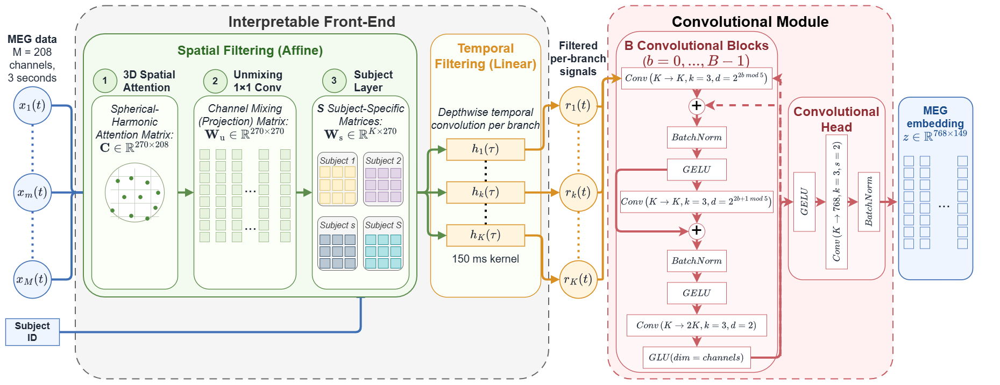

# LISA: Interpretable MEG-to-Audio Retrieval

<p align="center">
  <a href="https://arxiv.org/abs/2608.01481"></a>
  <a href="https://ivsemenkov.github.io/LISA/"></a>
  <a href="https://huggingface.co/papers/2608.01481"></a>
</p>

<p align="center">
  <a href="docs/assets/architecture.png">
    
  </a>
</p>

LISA (**Linear, Interpretable, Slim and Aware**) is a compact neural architecture
for decoding natural-speech MEG. It learns explicit spatial and temporal filters,
then maps each MEG segment to the Wav2Vec2 representation of the corresponding
audio segment using a contrastive retrieval objective.

This repository contains the preprocessing, training, evaluation, and analysis
code used for the MEG-MASC experiments, together with reusable LISA modules for
other EEG/MEG tasks.

> **Publication.** This is the official implementation of
> [*Interpretable MEG Decoding of Perceived Speech: Cortical Sources and the
> Stimulus Features That Drive Retrieval*](https://arxiv.org/abs/2608.01481). See the
> [project page](https://ivsemenkov.github.io/LISA/).

## Start here

| Goal | Where to go |
|---|---|
| Train the reference model on MEG-MASC | Follow the [MEG-MASC quickstart](#meg-masc-quickstart) below |
| Reproduce the experiment matrix, tables, or figures | [Reproducing the experiments](documentation/REPRODUCE.md) |
| Change a model or training option | [Hyperparameter reference](documentation/HYPERPARAMETERS.md) |
| Understand the architecture and tensor flow | [Architecture](documentation/ARCHITECTURE.md) |
| Use LISA on another task or dataset | [Adapting LISA](documentation/ADAPTING.md) and the [synthetic demo](notebooks/demo.ipynb) |
| Run or understand the tests | [Test-suite guide](tests/README.md) |

## What LISA does

For each MEG window, LISA applies:

1. an optional coordinate-parameterized spatial-attention layer;
2. shared and subject-specific linear spatial transforms;
3. one explicit temporal filter per interpretable branch;
4. a compact temporal-convolutional tail; and
5. a projection head that produces the retrieval representation.

The spatial and temporal filters can be extracted directly for post-hoc
interpretation. The bundled analysis tools cover sensor-space filters and
patterns, template-space source projections, branch clustering, ablations, and
occlusion-feature analysis.

The default reference model uses 25 interpretable branches and two temporal
convolutional blocks. Exact shapes, equations, and optional components are
documented in [ARCHITECTURE.md](documentation/ARCHITECTURE.md).

## Requirements

Using the LISA architecture does **not** require MEG-MASC or 300 GB of storage.
For the synthetic demo or a new dataset, you only need the Python 3.11 `LISA`
environment. The provided environment
setup uses Conda. CPU execution is supported; a CUDA-capable GPU is useful for
training but is not required by the model.

Reproducing the MEG-MASC experiments uses both Conda environments and the
downloaded dataset. Its cleaned-data pipeline needs approximately 300 GB only at
its peak, while the raw recordings, cleaned FIF files, and derived arrays
coexist. The retained working set can be smaller after preparation; see
[Disk space for MEG-MASC](#disk-space-for-meg-masc). Run all commands from
the repository root.

## MEG-MASC quickstart

The commands below use Bash wrapper scripts. After installation, the `lisa-*`
commands invoke Python directly and do not require Bash.

### 1. Create the environments

The workflow uses two environments: `MFAligner` for forced alignment and `LISA`
for preprocessing, training, and analysis.

```bash
bash scripts/setup_mfa_env.sh
bash scripts/setup_main_env.sh
```

The main setup installs Python 3.11 and PyTorch 2.6.0 with CUDA 11.8. For a
CPU-only PyTorch environment:

```bash
bash scripts/setup_main_env.sh cpu
```

The scripts stop if an environment with the same name already exists. To replace
one intentionally:

```bash
FORCE_RECREATE=1 bash scripts/setup_main_env.sh
```

PyTorch is installed separately by the setup script because CUDA wheels require
a dedicated package index; it is therefore not listed as a regular dependency in
`pyproject.toml`.

### 2. Download MEG-MASC and the ICA solutions

```bash
bash scripts/download_dataset.sh
```

The downloader is resumable and writes files atomically:

```text
data/MASC-MEG/   raw MEG-MASC recordings and stimuli
data/clean/      fitted ICA objects; cleaned FIF files are created here later
```

The recordings and stimuli come from MEG-MASC. Please cite the dataset when
using them:

- Gwilliams, L., Flick, G., Marantz, A., Pylkkänen, L., Poeppel, D., and
  King, J.-R. *Introducing MEG-MASC: a high-quality magneto-encephalography
  dataset for evaluating natural speech processing*. Scientific Data 10, 862
  (2023). [doi:10.1038/s41597-023-02752-5](https://doi.org/10.1038/s41597-023-02752-5).

MEG-MASC is available from its
[OSF repository](https://doi.org/10.17605/OSF.IO/AG3KJ). Our fitted ICA objects
are hosted in a [separate OSF project](https://osf.io/3wrft/). These external
files are not covered by this repository's MIT license. Check the current
license or reuse terms on the linked OSF project pages before using them.

For OSF projects that require authentication:

```bash
export OSF_TOKEN="<your-token>"
bash scripts/download_dataset.sh
```

### 3. Align the story audio and transcripts

```bash
bash scripts/run_mfa.sh
```

This prepares the story stimuli, expands numbers, builds a pronunciation
dictionary, and runs Montreal Forced Aligner. Alignments are written under
`data/MASC-MEG/stimuli/combined_mfa/`.

### 4. Build the model inputs

The reference experiments use the supplied, manually reviewed ICA solutions:

```bash
bash scripts/prepare_dataset.sh clean 8
```

The second argument is the number of parallel CPU jobs; use `-1` for all
available CPUs.

The scripts also support preprocessing the original BIDS recordings without
applying the supplied ICA solutions:

```bash
bash scripts/prepare_dataset.sh raw 8
```

This `raw` path is implemented and its core BIDS loading and preprocessing path
works, but it was not used for the reported experiments and has not been tested
end to end on the complete downloaded dataset. Treat it as a supported but less
thoroughly validated alternative; it may require troubleshooting and will not
reproduce the cleaned-data results.

On a cluster, the GPU and CPU stages can be run separately:

```bash
# Audio chunks and Wav2Vec2 embeddings
bash scripts/prepare_dataset_gpu.sh

# ICA application, MEG preprocessing, and quality control
bash scripts/prepare_dataset_cpu.sh clean 8
```

The main generated inputs are:

```text
data/preprocessed/audio/       Wav2Vec2 audio embeddings
data/preprocessed/dataframe/   segment metadata and MEG/audio alignment
data/preprocessed/meg/         preprocessed 100 Hz MEG arrays and scaler sidecar
outputs/plots/meg_qc/          preprocessing quality-control reports
```

MEG preprocessing writes normalized arrays such as
`data/preprocessed/meg/meg27_sr100.npz` and the scaler sidecar
`data/preprocessed/meg/meg27_sr100_scalers.npz`. Training uses the normalized
MEG. Physiological and source interpretation load the sidecar to invert the
channel preprocessing transform and restore physical sensor scaling.

The repository also includes MEG-MASC-specific coordinate assets under
`data/preprocessed/coords/`:

- `sensor_xyz.npy` contains the 3D positions of the 208 MEG sensors used by
  3D spatial attention; and
- `coords208_xy_scaled.npy` contains normalized 2D sensor positions used by
  2D spatial attention, spatial dropout, and sensor-neighbour analyses.

Source analysis uses participant- and session-specific KIT sensor geometry.
It reads the raw BIDS digitization and marker files (ELP, HSP, and MRK),
builds a participant-specific sensor-to-head coregistration and forward
solution, and places the group analysis in the shared MNE `fsaverage`
coordinate frame. Training does not use that source geometry.

`sensor_xyz.npy` and `coords208_xy_scaled.npy` are specific to the MEG-MASC
sensor layout. When adapting LISA to another layout, provide the corresponding
sensor coordinates.

### Disk space for MEG-MASC

Starting from the downloaded MEG-MASC data, the current cleaned-data pipeline
requires approximately **300 GB of free disk space during preparation**. The raw
recordings, cleaned FIF files, and preprocessed arrays must coexist while
`prepare_dataset.sh clean ...` runs. Training reads normalized MEG from
`data/preprocessed/`.

A training-only workflow can use those prepared arrays. The main 3-second
preprocessed inputs occupy approximately 18 GB. After they exist, deleting
`data/MASC-MEG/sub-*` recovers approximately 100 GB. The stimuli,
`data/clean/`, and `data/preprocessed/` that remain occupy about 180 GB.

Complete revised source and localization reproduction also requires the
original digitization and marker geometry in the BIDS tree
(`data/MASC-MEG/sub-*/ses-*/meg/`, including the ELP, HSP, and MRK files).
Keep those files, the stimuli, `data/clean/`, and `data/preprocessed/` when
reproducing that analysis. The prepared arrays are not distributed with this
repository, so a from-scratch MEG-MASC reproduction still encounters the 300 GB
preparation peak.

None of these MEG-MASC storage requirements apply when using the LISA
architecture with your own data.

### 5. Train the reference model

```bash
conda activate LISA

lisa-train --run-group quickstart-2conv-seed42
```

The defaults select the 25-branch, two-block model, seed 42, CUDA, and local
disk logging. Use `--device cpu` for CPU training.

Runs are written to:

```text
outputs/experiments/<run-group>/<run-name>_<run-id>/
```

Each completed run contains its effective configuration, metrics, best
validation checkpoint, final-test retrieval results, and extracted filter
arrays. Checkpoint selection uses validation loss; the test split is not used
for optimizer updates or checkpoint selection.

Use `lisa-train --help` for a compact option summary or
[HYPERPARAMETERS.md](documentation/HYPERPARAMETERS.md) for complete semantics and
constraints.

## Reproducing the paper experiments

[REPRODUCE.md](documentation/REPRODUCE.md) is the source of truth for the
paper's experiment workflow. It contains:

- preprocessing checks and canonical sample counts;
- the complete 320-run final-paper training matrix;
- the common training protocol and exact command loops;
- sanity values for the selected model;
- commands for the maintained training, evaluation, and interpretation
  analyses used in the paper; and
- smaller reproduction paths when the full matrix is unnecessary.

The complete workflow is intentionally not duplicated here. A full reproduction
needs approximately 300 GB only at the preparation peak. Training can use the
prepared arrays; revised source reproduction also keeps the BIDS digitization
and marker files. The main 3-second preprocessed inputs occupy approximately
18 GB.

## Using LISA on another task

The model itself is not tied to audio retrieval. You can use the interpretable
front-end or the complete encoder with another classification, regression,
sequence, or contrastive-learning head.

The [synthetic classification notebook](notebooks/demo.ipynb) is the fastest
place to start. It requires no MEG-MASC data and demonstrates:

- construction of a small LISA encoder;
- a separate task-specific classification head;
- training on synthetic neural signals; and
- extraction of temporal filters, spatial filters, and spatial patterns.

For another dataset, you will normally need to provide sensor coordinates,
sampling-rate-appropriate temporal settings, subject indices when using the
subject layer, and a task-specific loss. The boundaries between reusable modules
and MEG-MASC-specific code are listed in
[ADAPTING.md](documentation/ADAPTING.md).

## Inspecting completed runs

Build a compact registry of locally generated runs:

```bash
lisa-scan-runs --experiments-root outputs/experiments --out outputs/run_registry.csv
```

Export parameter counts and final metrics while checking that every discovered
configuration can be reconstructed:

```bash
lisa-export-parameter-counts --experiments-root outputs/experiments --out outputs/model_parameter_counts.csv --strict
```

Plotting and interpretation commands are introduced at the point where they are
needed in [REPRODUCE.md](documentation/REPRODUCE.md). Every installed
`lisa-*` command supports `--help`.

## Tests

The test suite is self-contained: it does not download models, access OSF, or
require MEG-MASC.

```bash
conda activate LISA
python -m pip install -e ".[dev]"
MPLBACKEND=Agg pytest -q tests/
```

See [tests/README.md](tests/README.md) for targeted test groups, coverage, and
known limits. GPU execution and full end-to-end data preparation are outside the
unit-test scope.

## Repository layout

```text
README.md                       project entry point and quickstart
documentation/REPRODUCE.md      complete paper experiment workflow
documentation/ARCHITECTURE.md   model equations and tensor flow
documentation/HYPERPARAMETERS.md
documentation/ADAPTING.md       reuse on other tasks and datasets
notebooks/demo.ipynb            self-contained synthetic example
scripts/                        environment and data-preparation entry points
src/lisa/                       package source and command-line tools
tests/                          unit and regression tests
```

## Citation

If this work helps your research, please cite:

[Semenkov, I., Kleeva, D., Dakhtin, I., Maksudova, Z., & Ossadtchi, A. (2026).
*Interpretable MEG Decoding of Perceived Speech: Cortical Sources and the
Stimulus Features That Drive Retrieval*. arXiv:2608.01481
(cs.LG).](https://arxiv.org/abs/2608.01481)

```bibtex
@misc{semenkov2026interpretablemegdecodingperceived,
      title={Interpretable MEG Decoding of Perceived Speech: Cortical Sources and the Stimulus Features That Drive Retrieval},
      author={Ilia Semenkov and Daria Kleeva and Ivan Dakhtin and Zarina Maksudova and Alex Ossadtchi},
      year={2026},
      eprint={2608.01481},
      archivePrefix={arXiv},
      primaryClass={cs.LG},
      url={https://arxiv.org/abs/2608.01481},
}
```

## Related work

The retrieval formulation and architecture build on the contrastive
brain-to-audio decoding framework introduced by
[Défossez, A., Caucheteux, C., Rapin, J., Kabeli, O., & King, J.-R. (2023).
*Decoding speech perception from non-invasive brain recordings*. Nature Machine
Intelligence, 5, 1097–1107.](https://doi.org/10.1038/s42256-023-00714-5) LISA
uses independently preprocessed MEG-MASC data and introduces a compact,
explicitly interpretable architecture and accompanying analyses.

## Acknowledgements

We thank Alexey Voskoboynikov for the original version of the code partly
reproducing the results of Défossez et al. (2023).

## License

LISA is released under the [MIT License](LICENSE).
